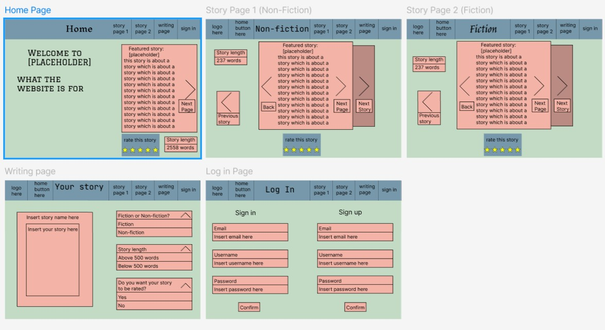
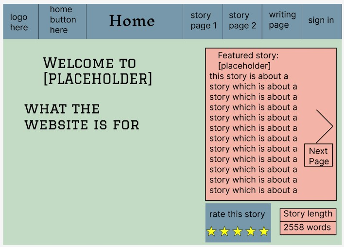
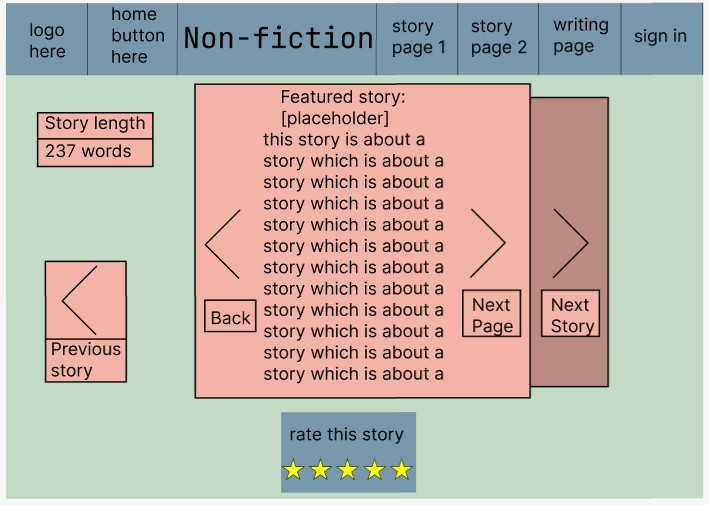
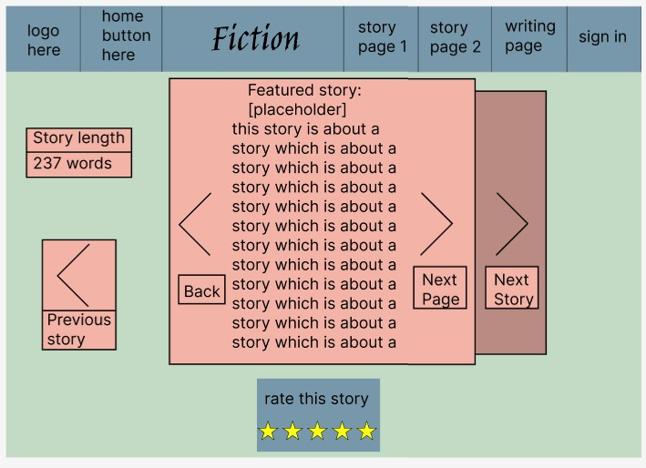
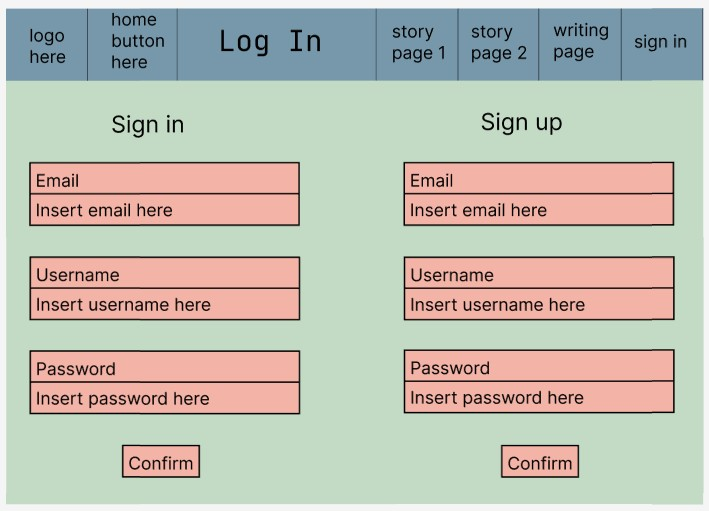
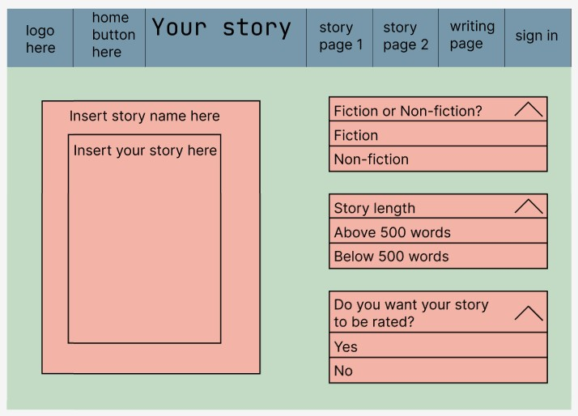
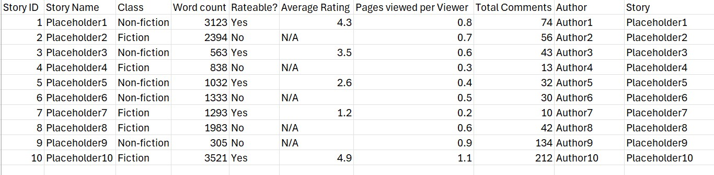

# Computing-Assessment-task-3
This website is about sharing stories.
## Website Goal
The website will include stories about crimes or interesting occurances, some non-fiction and some fiction. 

The user will be able to read either non-fiction or fictional stories and will also be able to include their own by signing in and writing their own story. Signing in will also allow the user to rate the story. The rating of a story will help decide if the story should be brought back on a later date.

Each day 3 non-fiction and 3 fictional stories will be chosen at random from a database to be shown that day. Which stories are chosen will be affected by if they have been shown before, what their rating is, and how long ago they were shown.

## Requirements

# Functional
1. Collects data on which stories people liked and uses that data to determine what sort of stories to show in the future
2. 
3. Shows a new set stories each day 

# Non-Functional
1. Lets users view stories
2. Lets users upload stories
3. Minimun of to 1000 users at once

# Design 1

Will include 5 pages
1. Home page
2. Story Page 1 (non-fiction)
3. Story page 2 (fiction)
4. Sign In/Sign up Page
5. Upload Page

### Home Page 
Includes buttons to navigate to each story page along with a button to sign in and different buttons to upload non-fiction and fictional storys respectively.
Explantion of what is included in the website.

### Story Page 1
Non-fiction.
There will be a story in the centre on the page with arrows that let you flip through up to 3 stories. There will be a button to get back to the Home page and a button to upload a non-fiction story. The button will take the user to the Upload page with the story already being selected as non-fiction.

### Story Page 2
Fiction.
There will be a story in the centre on the page with arrows that let you flip through up to 3 stories. There will be a button to get back to the Home page and a button to upload a fictional story. The button will take the user to the Upload page with the story already being selected as fiction.

### Sign In/Sign up Page
This page will include a place to insert your email address or username and your password to sign in or a link to a place where the user can insert their email address and create a username and password. Signing in lets the user upload their own stories, fictional or not.

### Upload Page 
To get to upload page you must be signed in. If the user is not signed in they will be redirected to the sign in page.
This page will include a mandatory form where the user will need to specify if there story is non-fiction or fiction (dropdown menu), where the story is set (textbox) and whether the user wants their story to be able to be rated. 
Below this there will be a text box where the user can write up their story. 
Once the user has finished writing their story they can submit their story which will be added to a database. 

# Design 2
Each Page will include the same functions and non-functions.

1. Home page
Collects Story data from the featured story

2. Story Page 1 (non-fiction)
Collects data including the ratings, how many pages the user has viewed and any comments (Story data)
Uses the data to decide what stories are shown each day.

3. Story page 2 (fiction)
Collects Story data
Uses data to decide what stories are shown each day

4. Sign In/Sign up Page
Collects the users email, password and username.

5. Upload Page
Collects the story name, the story, whether it is non-fiction or not, the amount of words and whether the story can be rated. This data will be stored of a spreadsheet where the story will be given an ID.

The spreadsheet will collect and organise the data like this

