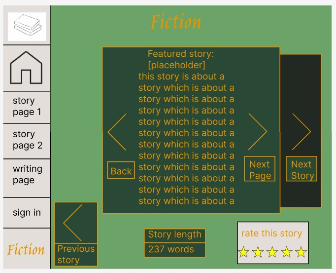

# Computing-Assessment-task-3
This website is about sharing stories.
## Website Goal
The website will include stories about crimes or interesting occurances, some non-fiction and some fiction. 

The user will be able to read either non-fiction or fictional stories and will also be able to include their own by signing in and writing their own story. Signing in will also allow the user to rate the story. The rating of a story will help decide if the story should be brought back on a later date.

Each day 3 non-fiction and 3 fictional stories will be chosen at random from a database to be shown that day. Which stories are chosen will be affected by if they have been shown before, what their rating is, and how long ago they were shown.

## Requirements

# Functional
1. Collects data on which stories people liked and uses that data to determine what sort of stories to show in the future
2. 
3. Shows a new set stories each day 

# Non-Functional
1. Lets users view stories
2. Lets users upload stories
3. Minimun of to 1000 users at once

# Design 1

Will include 5 pages
1. Home page
2. Story Page 1 (non-fiction)
3. Story page 2 (fiction)
4. Sign In/Sign up Page
5. Upload Page

### Home Page 
Includes buttons to navigate to each story page along with a button to sign in and different buttons to upload non-fiction and fictional storys respectively.
Explantion of what is included in the website.

### Story Page 1
Non-fiction.
There will be a story in the centre on the page with arrows that let you flip through up to 3 stories. There will be a button to get back to the Home page and a button to upload a non-fiction story. The button will take the user to the Upload page with the story already being selected as non-fiction.

### Story Page 2
Fiction.
There will be a story in the centre on the page with arrows that let you flip through up to 3 stories. There will be a button to get back to the Home page and a button to upload a fictional story. The button will take the user to the Upload page with the story already being selected as fiction.

### Sign In/Sign up Page
This page will include a place to insert your email address or username and your password to sign in or a link to a place where the user can insert their email address and create a username and password. Signing in lets the user upload their own stories, fictional or not.

### Upload Page 
To get to upload page you must be signed in. If the user is not signed in they will be redirected to the sign in page.
This page will include a mandatory form where the user will need to specify if there story is non-fiction or fiction (dropdown menu), where the story is set (textbox) and whether the user wants their story to be able to be rated. 
Below this there will be a text box where the user can write up their story. 
Once the user has finished writing their story they can submit their story which will be added to a database. 

# Design 2
Each Page will include the same functions and non-functions.

1. Home page
2. Story Page 1 (Non-fiction)
3. Story page 2 (Fiction)
4. Sign In/Sign up Page
5. Upload Page

### Home page
Collects Story data from the featured story

### Story Page 1 (non-fiction)
Collects data including the ratings, how many pages the user has viewed and any comments (Story data)
Uses the data to decide what stories are shown each day.

### Story page 2 (fiction)
Collects Story data
Uses data to decide what stories are shown each day

### Sign In/Sign up Page
Collects the users email, password and username.

### Upload Page
Collects the story name, the story, whether it is non-fiction or not, the amount of words and whether the story can be rated. 

### Data Collection

All data will collected and stored on a spreadsheet where each the story will be given an ID to help sort through the stories better. Once this is complete, each story will have:
1. A Story ID
2. A name
3. A class (fiction or non-fiction)
4. Word count
5. If the story is rateable
6. Average rating
7. Average Pages viewed per user
8. Amount of comments
9. Author username
10. Author email
11. The actual story

This is an example spreadsheet with the above organised with fake data:

| Items to change | How they were changed |
| ----------- | ----------- |
| Taskbar | Changed from the top to the left side |
| Colour pallette | Changed to make each part stand out more |
| Typography | Changed to make it easier to read |
| Branding | Changed each part so the important parts were centered |

# Algorithm

## Sign up

1. Declare variables: email, password, username, other_username
2. Prompt user to enter email, password, username
3. Get email, password, username
4. IF username is equal to other_username, THEN
4. 1. DO
4. 1. 1. Display error message, "Username has been taken”
4. 1. 2. Prompt user to enter username
4. 1. 3. Get username 
4. 2. WHILE username is equal to other_username
5. ENDIF
6. IF password length is lesser than 6, THEN
6. 1. DO
6. 1. 1. Display error message, "Password is too short”
6. 1. 2. Prompt user to enter password
6. 1. 3. Get password
6. 2. WHILE password length is lesser than 6
7. ENDIF
8. IF password has less than 1 capital letter, THEN
8. 1. DO
8. 1. 1. Display error message, "Password needs a capital letter”
8. 1. 2. Prompt user to enter password
8. 1. 3. Get password
8. 2. WHILE password has capital_letter lesser than 1
9. ENDIF
10. IF email has been used, THEN
10. 1. DO
10. 1. 1. Display error message, "Email is in use”
10. 1. 2. Prompt user to enter email
10. 1. 3. Get email
10. 2. WHILE email has been used
10. ENDIF
11. Display email, password, username

The algorithm will let any number of users sign up, each with different usernames and passwords. An increase in users will not affect the efficiency of the algorithm.

## Test Case 1
Test Case ID: TC001
Test Case name: User Sign Up
Preconditions: User does not have an account
Test steps:
1. Open the website
2. Navigate to the sign up page
3. Enter valid username, email and password
4. Click Sign Up
Expected result: User data is added to database, user is able to Sign in

## Test Case 2
Test Case ID: TC002
Test Case name: User Log In
Preconditions: User has an account
Test steps:
1. Open the website
2. Navigate to the log in page
3. Enter valid username/email and password
4. Click Log In
Expected result: User data is added to database, user is able to rate and comment on stories

